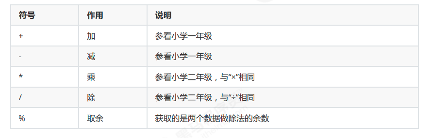
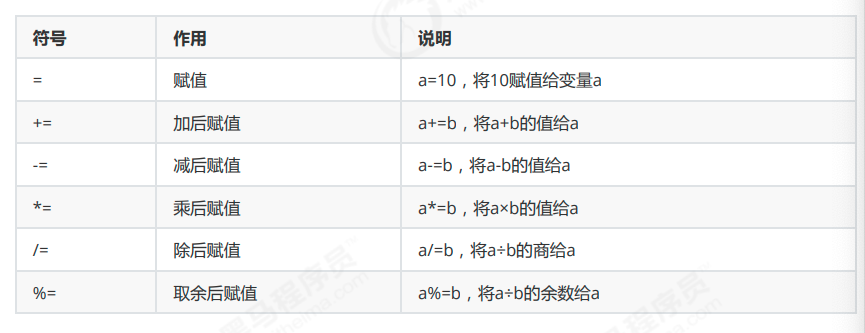
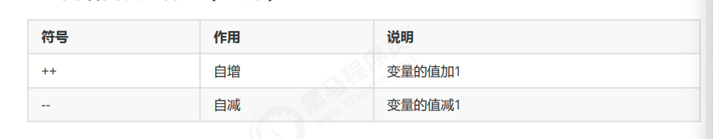
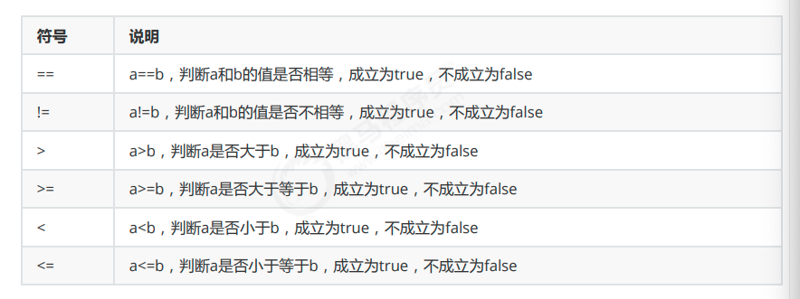
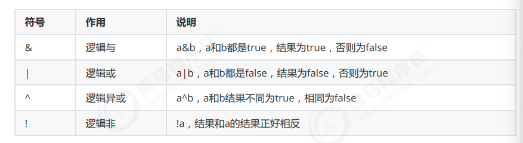
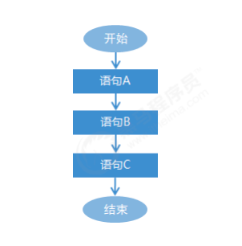
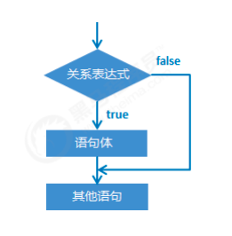
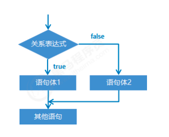

# day02 - Java基础语法

## 1. 运算符

## 1.1 算术运算符（理解）

#### 1.1.1 运算符和表达式

 运算符：对常量或者变量进行操作的符号

 表达式：用运算符把常量或者变量连接起来符合java语法的式子就可以称为表达式。

 不同运算符连接的表达式体现的是不同类型的表达式。

 举例说明：
```
int a = 10 ;
int b = 20 ;
int c = a + b;
```

 +：是运算符，并且是算术运算符。

 a + b：是表达式，由于+是算术运算符，所以这个表达式叫算术表达式。

#### 1.1.2 算术运算符



注意：

/和%的区别：两个数据做除法，/取结果的商，%取结果的余数。

整数操作只能得到整数，要想得到小数，必须有浮点数参与运算。


```
int a = 10 ;
int b = 3 ;
System.out.println(a / b); // 输出结果 3
System.out.println(a % b); // 输出结果 1
```

#### 1.1.3 字符的“+”操作

 char类型参与算术运算，使用的是计算机底层对应的十进制数值。需要我们记住三个字符对应的数值：

 'a' -- 97 a-z是连续的，所以'b'对应的数值是 98 ，'c'是 99 ，依次递加

 'A' -- 65 A-Z是连续的，所以'B'对应的数值是 66 ，'C'是 67 ，依次递加

 '0' -- 48 0-9是连续的，所以'1'对应的数值是 49 ，'2'是 50 ，依次递加
 ```java
 // 可以通过使用字符与整数做算术运算，得出字符对应的数值是多少
char ch1 = 'a';
System.out.println(ch1 + 1); // 输出98，97 + 1 = 98
char ch2 = 'A';
System.out.println(ch2 + 1); // 输出66，65 + 1 = 66
char ch3 = '0';
System.out.println(ch3 + 1); // 输出49，48 + 1 = 49
 ```

 算术表达式中包含不同的基本数据类型的值的时候，整个算术表达式的类型会自动进行提升。

 提升规则：

 byte类型，short类型和char类型将被提升到int类型，不管是否有其他类型参与运算。

 整个表达式的类型自动提升到与表达式中最高等级的操作数相同的类型

 等级顺序：byte,short,char --> int --> long --> float --> double

 例如：
```java
byte b1 = 10;
byte b2 = 20;
// byte b3 = b1 + b2; // 该行报错，因为byte类型参与算术运算会自动提示为int，int赋值给byte可能损失精度
int i3 = b1 + b2; // 应该使用int接收
byte b3 = (byte) (b1 + b2); // 或者将结果强制转换为byte类型
//-------------------------------
int num1 = 10;
double num2 = 20.0;
double num3 = num1 + num2; // 使用double接收，因为num1会自动提升为double类型
```
 tips：正是由于上述原因，所以在程序开发中我们很少使用byte或者short类型定义整数。也很少会使用char类型定义字符，而使用字符串类型，更不会使用char类型做算术运算。

#### 1.1.4 字符串的“+”操作

 当“+”操作中出现字符串时，这个”+”是字符串连接符，而不是算术运算。
```java
 System.out.println("it"+ 666); // 输出：it666
```
 在”+”操作中，如果出现了字符串，就是连接运算符，否则就是算术运算。当连续进行“+”操作时，从左到右逐个执行。

### 1.2 赋值运算符（应用）

 赋值运算符的作用是将一个表达式的值赋给左边，左边必须是可修改的，不能是常量。



 注意：

 扩展的赋值运算符隐含了强制类型转换。

```java
short s = 10;
s = s + 10; // 此行代码报出，因为运算中s提升为int类型，运算结果int赋值给short可能损失精度
s += 10; // 此行代码没有问题，隐含了强制类型转换，相当于 s = (short) (s + 10);
```


### 1.3 自增自减运算符（理解）



 注意事项：

 ++和-- 既可以放在变量的后边，也可以放在变量的前边。

 单独使用的时候， ++和-- 无论是放在变量的前边还是后边，结果是一样的。

 参与操作的时候，如果放在变量的后边，先拿变量参与操作，后拿变量做++或者--。

 参与操作的时候，如果放在变量的前边，先拿变量做++或者--，后拿变量参与操作。

 最常见的用法：单独使用。

```java
int i = 10;
i++; // 单独使用
System.out.println("i:" + i); // i:11
int j = 10;
++j; // 单独使用
System.out.println("j:" + j); // j:11
int x = 10;
int y = x++; // 赋值运算，++在后边，所以是使用x原来的值赋值给y，x本身自增1
System.out.println("x:" + x + ", y:" + y); // x:11，y:10
int m = 10;
int n = ++m; // 赋值运算，++在前边，所以是使用m自增后的值赋值给n，m本身自增1
System.out.println("m:" + m + ", m:" + m); // m:11，m:11
```


##### 练习：

```java
int x = 10;
int y = x++ + x++ + x++;
System.out.println(y); // y的值是多少？
/*
解析，三个表达式都是++在后，所以每次使用的都是自增前的值，但程序自左至右执行，所以第一次自增时，使用的是
10进行计算，但第二次自增时，x的值已经自增到11了，所以第二次使用的是11，然后再次自增。。。
所以整个式子应该是：int y = 10 + 11 + 12;
输出结果为33。
*/
注意：通过此练习深刻理解自增和自减的规律，但实际开发中强烈建议不要写这样的代码！小心挨打！
```


### 1.4 关系运算符（应用）

 关系运算符有 6 种关系，分别为小于、小于等于、大于、等于、大于等于、不等于。



 注意事项：

 关系运算符的结果都是boolean类型，要么是true，要么是false。

 千万不要把“==”误写成“=”，"=="是判断是否相等的关系，"="是赋值。
```java
int a = 10;
int b = 20;
System.out.println(a == b); // false
System.out.println(a != b); // true
System.out.println(a > b); // false
System.out.println(a >= b); // false
System.out.println(a < b); // true
System.out.println(a <= b); // true
// 关系运算的结果肯定是boolean类型，所以也可以将运算结果赋值给boolean类型的变量
boolean flag = a > b;
System.out.println(flag); // 输出false
```
### 1.5 逻辑运算符（应用）

 逻辑运算符把各个运算的关系表达式连接起来组成一个复杂的逻辑表达式，以判断程序中的表达式是否成立，判断的结果是 true 或 false。


```java
//定义变量
int i = 10;
int j = 20;
int k = 30;
//& “与”，并且的关系，只要表达式中有一个值为false，结果即为false
System.out.println((i > j) & (i > k)); //false & false,输出false
System.out.println((i < j) & (i > k)); //true & false,输出false
System.out.println((i > j) & (i < k)); //false & true,输出false
System.out.println((i < j) & (i < k)); //true & true,输出true
System.out.println("--------");
//| “或”，或者的关系，只要表达式中有一个值为true，结果即为true
System.out.println((i > j) | (i > k)); //false | false,输出false
System.out.println((i < j) | (i > k)); //true | false,输出true
System.out.println((i > j) | (i < k)); //false | true,输出true
System.out.println((i < j) | (i < k)); //true | true,输出true
System.out.println("--------");
//^ “异或”，相同为false，不同为true
System.out.println((i > j) ^ (i > k)); //false ^ false,输出false
System.out.println((i < j) ^ (i > k)); //true ^ false,输出true
System.out.println((i > j) ^ (i < k)); //false ^ true,输出true
System.out.println((i < j) ^ (i < k)); //true ^ true,输出false
System.out.println("--------");
//! “非”，取反
System.out.println((i > j)); //false
System.out.println(!(i > j)); //!false，,输出true
```


#### 短路逻辑运算符


 在逻辑与运算中，只要有一个表达式的值为false，那么结果就可以判定为false了，没有必要将所有表达式的值都计算出来，短路与操作就有这样的效果，可以提高效率。同理在逻辑或运算中，一旦发现值为true，右边的表达式将不再参与运算。
 逻辑与&，无论左边真假，右边都要执行。 
 短路与&&，如果左边为真，右边执行；如果左边为假，右边不执行。
 逻辑或|，无论左边真假，右边都要执行。
 短路或||，如果左边为假，右边执行；如果左边为真，右边不执行。

### 1.6 三元运算符（理解）

 三元运算符语法格式：
 ```java
 关系表达式 ? 表达式1 : 表达式2;
 ```

 解释：问号前面的位置是判断的条件，判断结果为boolean型，为true时调用表达式 1 ，为false时调用表达式 2 。其逻辑为：如果条件表达式成立或者满足则执行表达式 1 ，否则执行第二个。

 举例：

```java
int a = 10;
int b = 20;
int c = a > b ? a : b; // 判断 a>b 是否为真，如果为真取a的值，如果为假，取b的值
```

##### 三元运算符案例：

 1 、需求：动物园里有两只老虎，已知两只老虎的体重分别为180kg、200kg，请用程序实现判断两只老虎的体重是否相同。
```java
public class OperatorTest01 {
public static void main(String[] args) {
//1：定义两个变量用于保存老虎的体重，单位为kg，这里仅仅体现数值即可。
int weight1 = 180;
int weight2 = 200;
//2：用三元运算符实现老虎体重的判断，体重相同，返回true，否则，返回false。
boolean b = weight1 == weight2 ? true : false;
//3：输出结果
System.out.println("b:" + b);
}
}
```
 2 、需求：一座寺庙里住着三个和尚，已知他们的身高分别为150cm、210cm、165cm，请用程序实现获取这三个和尚的最高身高。

```java
public class OperatorTest02 {
public static void main(String[] args) {
//1：定义三个变量用于保存和尚的身高，单位为cm，这里仅仅体现数值即可。
int height1 = 150;
int height2 = 210;
int height3 = 165;
//2：用三元运算符获取前两个和尚的较高身高值，并用临时身高变量保存起来。
int tempHeight = height1 > height2 ? height1 : height2;
//3：用三元运算符获取临时身高值和第三个和尚身高较高值，并用最大身高变量保存。
int maxHeight = tempHeight > height3 ? tempHeight : height3;
//4：输出结果
System.out.println("maxHeight:" + maxHeight);
}
}
```


## 2. 数据输入（应用）

 我们可以通过 Scanner 类来获取用户的输入。使用步骤如下：

 1 、导包。Scanner 类在java.util包下，所以需要将该类导入。导包的语句需要定义在类的上面。
```java
import java.util.Scanner;
```
 2 、创建Scanner对象。
```java
Scanner sc = new Scanner(System.in);// 创建Scanner对象，sc表示变量名，其他均不可变
```
 3 、接收数据
```java
int i = sc.nextInt(); // 表示将键盘录入的值作为int数返回。
```
 示例：
```java
import java.util.Scanner;
public class ScannerDemo {
public static void main(String[] args) {
//创建对象
Scanner sc = new Scanner(System.in);
//接收数据
int x = sc.nextInt();
//输出数据
System.out.println("x:" + x);
}
}
```
 改写三个和尚案例，数据使用键盘录入。
```java
import java.util.Scanner;
public class ScannerTest {
public static void main(String[] args) {
//身高未知，采用键盘录入实现。首先导包，然后创建对象。
Scanner sc = new Scanner(System.in);
//键盘录入三个身高分别赋值给三个变量。
System.out.println("请输入第一个和尚的身高：");
int height 1 = sc.nextInt();
System.out.println("请输入第二个和尚的身高：");
int height 2 = sc.nextInt();
System.out.println("请输入第三个和尚的身高：");
int height 3 = sc.nextInt();
//用三元运算符获取前两个和尚的较高身高值，并用临时身高变量保存起来。
int tempHeight = height 1 > height 2? height 1 : height 2 ;
//用三元运算符获取临时身高值和第三个和尚身高较高值，并用最大身高变量保存。
int maxHeight = tempHeight > height 3? tempHeight : height 3 ;
//输出结果。
System.out.println("这三个和尚中身高最高的是：" + maxHeight +"cm");
}
}
```
## 3. 流程控制语句（应用）

 在一个程序执行的过程中，各条语句的执行顺序对程序的结果是有直接影响的。所以，我们必须清楚每条语句的执行流程。而且，很多时候要通过控制语句的执行顺序来实现我们想要的功能。

### 3.1 流程控制语句分类

 顺序结构

 分支结构(if, switch)

 循环结构(for, while, do...while)

### 3.2 顺序结构

 顺序结构是程序中最简单最基本的流程控制，没有特定的语法结构，按照代码的先后顺序，依次执行，程序中大多数的代码都是这样执行的。

 顺序结构执行流程图：



### 3.3 分支结构之if语句

 if语句格式 1

```
if (关系表达式) {
语句体;
}
```
 执行流程：

 ①首先计算关系表达式的值

 ②如果关系表达式的值为true就执行语句体

 ③如果关系表达式的值为false就不执行语句体

 ④继续执行后面的语句内容




 示例：

###### 格式：

```
public static void main(String[] args) {
System.out.println("开始");
//定义两个变量
int a = 10 ;
int b = 20 ;
//需求：判断a和b的值是否相等，如果相等，就在控制台输出：a等于b
if(a == b) {
System.out.println("a等于b");
}
//需求：判断a和c的值是否相等，如果相等，就在控制台输出：a等于c
int c = 10 ;
if(a == c) {
System.out.println("a等于c");
}
System.out.println("结束");
}
}
```

#### if语句格式 2


 格式：

```
if (关系表达式) {
语句体 1 ;
} else {
语句体 2 ;
}
```
 执行流程：

 ①首先计算关系表达式的值

 ②如果关系表达式的值为true就执行语句体 1

 ③如果关系表达式的值为false就执行语句体 2

 ④继续执行后面的语句内容



 示例：


```java
public class IfDemo 02 {
public static void main(String[] args) {
System.out.println("开始");
//定义两个变量
int a = 10 ;
int b = 20 ;
b = 5 ;
//需求：判断a是否大于b，如果是，在控制台输出：a的值大于b，否则，在控制台输出：a的值不大于b
if(a > b) {
System.out.println("a的值大于b");
} else {
System.out.println("a的值不大于b");
}
System.out.println("结束");
}
}
```

 if语句案例：奇偶数

 需求：任意给出一个整数，请用程序实现判断该整数是奇数还是偶数，并在控制台输出该整数是奇数还是偶数。

 分析：

 ①为了体现任意给出一个整数，采用键盘录入一个数据

 ②判断整数是偶数还是奇数要分两种情况进行判断，使用if..else结构

 ③判断是否偶数需要使用取余运算符实现该功能 number % 2 == 0

 ④根据判定情况，在控制台输出对应的内容
```
import java.util.Scanner;
public class IfTest 01 {
public static void main(String[] args) {
//为了体现任意给出一个整数，采用键盘录入一个数据。(导包，创建对象，接收数据)
Scanner sc = new Scanner(System.in);
System.out.println("请输入一个整数：");
int number = sc.nextInt();
//判断整数是偶数还是奇数要分两种情况进行判断，使用if..else结构
//判断是否偶数需要使用取余运算符实现该功能 number % 2 == 0
//根据判定情况，在控制台输出对应的内容
if(number% 2 == 0 ) {
System.out.println(number + "是偶数");
} else {
System.out.println(number + "是奇数");
}
}
}
```

#### if语句格式 3

```
格式：
if (关系表达式1) {
语句体1;
} else if (关系表达式2) {
语句体2;
}
…
else {
语句体n+1;
}
```

 执行流程：

 ①首先计算关系表达式 1 的值

 ②如果值为true就执行语句体 1 ；如果值为false就计算关系表达式 2 的值

 ③如果值为true就执行语句体 2 ；如果值为false就计算关系表达式 3 的值

 ④...

 ⑤如果没有任何关系表达式为true，就执行语句体n+1。


 示例：键盘录入一个星期数(1,2,...7)，输出对应的星期一，星期二，...星期日

```java
import java.util.Scanner;
public class IfDemo03 {
public static void main(String[] args) {
System.out.println("开始");
// 需求：键盘录入一个星期数(1,2,...7)，输出对应的星期一，星期二，...星期日
Scanner sc = new Scanner(System.in);
System.out.println("请输入一个星期数(1-7)：");
int week = sc.nextInt();
if(week == 1) {
System.out.println("星期一");
} else if(week == 2) {
System.out.println("星期二");
} else if(week == 3) {
System.out.println("星期三");
} else if(week == 4) {
System.out.println("星期四");
} else if(week == 5) {
System.out.println("星期五");
} else if(week == 6) {
System.out.println("星期六");
} else {
System.out.println("星期日");
}
System.out.println("结束");
}
}
```


 if语句格式 3 案例：

 需求：小明快要期末考试了，小明爸爸对他说，会根据他不同的考试成绩，送他不同的礼物，假如你可以控制小明的得分，请用程序实现小明到底该获得什么样的礼物，并在控制台输出。

 分析：

 ①小明的考试成绩未知，可以使用键盘录入的方式获取值

 ②由于奖励种类较多，属于多种判断，采用if...else...if格式实现

 ③为每种判断设置对应的条件

 ④为每种判断设置对应的奖励

```java
import java.util.Scanner;
public class IfTest02 {
public static void main(String[] args) {
//小明的考试成绩未知，可以使用键盘录入的方式获取值
Scanner sc = new Scanner(System.in);
System.out.println("请输入一个分数：");
int score = sc.nextInt();
//由于奖励种类较多，属于多种判断，采用if...else...if格式实现
//为每种判断设置对应的条件
//为每种判断设置对应的奖励
//数据测试：正确数据，边界数据，错误数据
if(score>100 || score<0) {
System.out.println("你输入的分数有误");
} else if(score>=95 && score<=100) {
System.out.println("山地自行车一辆");
} else if(score>=90 && score<=94) {
System.out.println("游乐场玩一次");
} else if(score>=80 && score<=89) {
System.out.println("变形金刚玩具一个");
} else {
System.out.println("胖揍一顿");
}
}
}
```

## 资料来源参考

- 资料来自互联网，侵权/推广请联系:feedback@geekdong.cn

---

<center>👇</center>

欢迎关注我的公众号“[程序员董同学](https://mp.weixin.qq.com/mp/profile_ext?action=home&__biz=MzkzNDE4NDgxMA==#wechat_redirect)”，原创技术文章第一时间推送。


